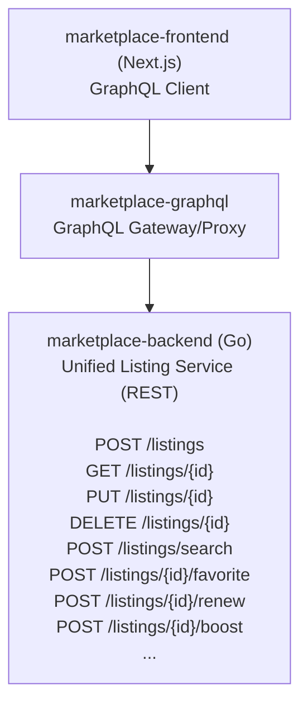

# Listing API requirements for Classifieds (draft)

This draft document describes similarity and difference between listings on Classifieds, Cars, Homes and Jobs verticals.

All four verticals (Classifieds, Cars, Homes, Jobs) share the same core operations and data structure:

**Common Operations** (100% shared):

- Create/Update/Delete listing
- Search listings with filters
- Get single listing
- Favorite/Unfavorite
- View statistics
- Upload/manage photos
- Contact seller

**Common Fields** (100% shared):

- Core: id, status, dates (create, modify, display, expire)
- Ownership: memberId
- Content: title, description, price
- Location: city, state, zip, coordinates
- Contact: name, email, phone
- Media: photos, videos
- Stats: views, favorites

# Listing Operations Comparison

## CLASSIFIEDS (CAPI - m-ksl-classifieds-api)

**Technology**: PHP/Symfony, MongoDB + MySQL, Elasticsearch, REST API

### Core CRUD Operations

| Operation | Endpoint | Method | Description |
| --- | --- | --- | --- |
| **Create Stub** | `/listings/create-stub` | POST | Create draft listing |
| **Get Listing** | `/listings/{id}` | GET | Retrieve single listing |
| **Search Listings** | `/listings` | GET | Search with filters |
| **Update Listing** | `/listings/{id}` | PUT | Update listing fields |
| **Delete Listing** | `/listings/{id}` | DELETE | Soft delete listing |
| **Renew Listing** | `/listings/{id}/renew` | PUT | Extend expiration |

### Favorite Operations

| Operation | Endpoint | Method | Description |
| --- | --- | --- | --- |
| **Add Favorite** | `/listings/{listingId}/favorites` | POST | Favorite a listing |
| **Remove Favorite** | `/listings/{listingId}/favorites` | DELETE | Unfavorite listing |
| **Update Favorite** | `/listings/{listingId}/favorites` | PUT | Update favorite (notifications) |

### Media Operations

| Operation | Endpoint | Method | Description |
| --- | --- | --- | --- |
| **Upload Photo** | `/listings/{id}/photos` | POST | Upload listing photo |
| **Edit Photo** | `/listings/{id}/photos/{photoId}` | POST | Edit photo metadata |
| **Delete Photo** | `/listings/{id}/photos/{photoId}` | DELETE | Remove photo |

### Search & Discovery

| Operation | Endpoint | Method | Description |
| --- | --- | --- | --- |
| **Search** | `/listings` | GET | Search with filters/facets |
| **Keyword Suggestions** | `/suggester/keyword-search-suggestions` | GET | Autocomplete |
| **Category Suggestions** | `/suggester/suggested-categories` | GET | Suggest categories from text |

### Homepage/Featured

| Operation | Endpoint | Method | Description |
| --- | --- | --- | --- |
| **My Listings** | `/homepage/my-listings` | GET | User’s listings summary |
| **My Favorites** | `/homepage/my-favorites` | GET | User’s favorites summary |
| **Top Listings** | `/homepage/top-listings` | GET | Featured/spotlight listings |
| **Rental Listings** | `/homepage/rental-listings` | GET | Rental category listings |
| **Saved Search Listings** | `/homepage/saved-search/{id}/listings` | GET | Listings matching saved search |

### Metadata & Support

| Operation | Endpoint | Method | Description |
| --- | --- | --- | --- |
| **Get Metadata** | `/listings/meta` | GET | Category options, fields |
| **Get Contact Info** | `/listings/contact-info` | GET | User’s default contact |
| **Renew Data** | `/listings/renew-data` | GET | Data for renewal flow |
| **Rental Rules** | `/listings/predefined-rental-rules` | GET | Preset rental rules |
| **Get Thanks Page** | `/listings/{id}/thanks-page` | GET | Post-purchase listing data |

### Stats & Analytics

| Operation | Endpoint | Method | Description |
| --- | --- | --- | --- |
| **Get Stats** | `/stats` | GET | Listing statistics |
| **Record View** | `/stats/view` | POST | Track listing view |

### Abuse & Moderation

| Operation | Endpoint | Method | Description |
| --- | --- | --- | --- |
| **Report Abuse** | `/abuse/{listingId}/reports` | POST | Report listing abuse |
| **Get Abuse Reports** | `/abuse/{listingId}` | GET | Get abuse history |

### Dealer/Seller Operations

| Operation | Endpoint | Method | Description |
| --- | --- | --- | --- |
| **Get Dealer** | `/dealer/{dealerId}` | GET | Dealer information |
| **Upload Logo** | `/dealer/{dealerId}/logo` | POST | Upload dealer logo |
| **CSL Config** | `/dealer/{dealerId}/csl-config` | GET/POST/DELETE | Auto-import config |
| **Bypass Fee** | `/dealer/{dealerId}/bypass-listing-fee` | PATCH | Update fee bypass |

### Spotlight/Featured

| Operation | Endpoint | Method | Description |
| --- | --- | --- | --- |
| **Get Spotlights** | `/spotlights` | GET | Get spotlight listings |
| **Add Spotlight** | `/spotlights` | POST | Add spotlight |
| **Update Spotlight** | `/spotlights` | PUT | Update spotlight |
| **Remove Spotlight** | `/spotlights` | DELETE | Remove spotlight |

### Saved Searches

| Operation | Endpoint | Method | Description |
| --- | --- | --- | --- |
| **Create** | `/saved-searches` | POST | Save search criteria |
| **Update** | `/saved-searches/{id}` | PUT | Update search |

### Payment

| Operation | Endpoint | Method | Description |
| --- | --- | --- | --- |
| **Create Payment Intent** | `/listings/create-payment-intent` | POST | Stripe payment setup |
| **Get Stripe Key** | `/payments/stripe-key` | GET | Public Stripe key |
| **Payment Methods** | `/payments/payment-methods` | GET | User’s payment methods |
| **Subscription Event** | `/payments/subscription-event` | PUT | Webhook handler |

### Categories

| Operation | Endpoint | Method | Description |
| --- | --- | --- | --- |
| **Get Tree** | `/categories` | GET | Full category tree |
| **Get Specifications** | `/categories/{cat}/{subcat}/specifications` | GET | Category-specific fields |

### Archive

| Operation | Endpoint | Method | Description |
| --- | --- | --- | --- |
| **Search Archive** | `/sub-categories/specifications` | GET | Search expired/sold listings |

## CARS (m-ksl-cars-api)

**Technology**: PHP/Symfony, MongoDB, Elasticsearch, REST API

### Core Operations

| Operation | Endpoint | Method | Description |
| --- | --- | --- | --- |
| **Get Listing** | `/listing/{id}` | GET | Retrieve car listing |
| **Create Listing** | `/listing` | POST | Create new car listing |
| **Search** | `/search` | POST | Search car listings |
| **Get from ES** | `/search/{id}` | GET | Get listing from Elasticsearch |
| **VDP Carousel** | `/search/vdp/carousel` | POST | Related cars for VDP |

### Favorite Operations

| Operation | Endpoint | Method | Description |
| --- | --- | --- | --- |
| **Toggle Favorite** | `/listing/favorite/{listingId}` | POST | Add/remove favorite |

### Communication

| Operation | Endpoint | Method | Description |
| --- | --- | --- | --- |
| **Email Seller** | `/listing/email/{id}` | POST | Send email to seller |

### Moderation

| Operation | Endpoint | Method | Description |
| --- | --- | --- | --- |
| **Flag Listing** | `/listing/flag/{listingId}` | POST | Report listing |

### Analytics

| Operation | Endpoint | Method | Description |
| --- | --- | --- | --- |
| **Get Views** | `/listing/total-views/{listingId}` | GET | Get view count |

### Media

| Operation | Endpoint | Method | Description |
| --- | --- | --- | --- |
| **Generate Thumbnails** | `/listing/generate-missing-thumbnails/{listingId}` | GET | Create missing thumbnails |

### Dealer Exchange (Backlot)

| Operation | Endpoint | Method | Description |
| --- | --- | --- | --- |
| **Favorite Auction** | `/backlot/auctions/{auctionId}/favorite` | POST | Favorite dealer auction |

**Note**: Cars uses frontend (m-ksl-cars) with ksl-api integration for full CRUD. The cars-api is focused on search/read operations.

## HOMES (m-ksl-homes)

**Technology**: PHP/Zend + React, MongoDB, Integration with Homie API

### Core Operations (via ksl-api integration)

| Operation | Method | Description |
| --- | --- | --- |
| **Get Listing** | `getActiveListing($id)` | Retrieve home listing |
| **Create Listing** | Via Sell Form | Create new home listing |
| **Update Listing** | Via Edit Form | Update home listing |
| **Delete Listing** | Via MyAccount | Soft delete listing |
| **Search Listings** | Via Search | Search homes/rentals |

### Homie Integration (Paid Listings)

| Operation | Endpoint | Method | Description |
| --- | --- | --- | --- |
| **Create Paid Listing** | Homie API | POST | Create listing on Homie platform |
| **Update Paid Listing** | Homie API | PUT | Update Homie listing |
| **Delete Listing** | Homie API | DELETE | Remove from Homie |

### Communities (New Construction)

| Operation | Method | Description |
| --- | --- | --- |
| **Get Community** | MongoDB Query | Retrieve community data |
| **Get Community Homes** | MongoDB Query | Homes in community |
| **Get Floorplans** | MongoDB Query | Available floorplans |

### Favorites & Searches

| Operation | Method | Description |
| --- | --- | --- |
| **Save Listing** | Via ksl-api | Favorite a home |
| **Saved Searches** | Via ksl-api | Save search criteria |

### Features

- Open House Dates
- MLS Integration
- Agent/Agency Information
- Standard Featured Ads
- Homepage Featured Toggle

**Note**: Homes primarily uses ksl-api for backend operations, with specialized Homie API integration for premium listings.

## JOBS (m-ksl-jobs)

**Technology**: PHP/Zend + GraphQL, MongoDB

### GraphQL Queries

| Query | Description |
| --- | --- |
| **job(id, memberId)** | Get single job listing |
| **jobs(filter, sortByTopJobStart, page, perpage)** | Search jobs with filters |
| **myListings(memberId)** | User’s job listings |
| **myFavorites(memberId)** | Favorited jobs |
| **savedSearches(memberId)** | Saved job searches |
| **myListingsApplications(memberId)** | Applications received |
| **transaction(transactionId)** | Purchase transaction details |
| **baseOptions** | Categories, options, metadata |
| **cartCalculation(lineItems, promocode)** | Calculate pricing |
| **package(packageId)** | Employer package details |
| **promoCodeReportEmails(memberId)** | Promo code reports |
| **myAccountEmployerInfo(memberId)** | Employer profile |
| **seoStates** | States for SEO pages |
| **locationsByZip(zip)** | City/state from zip |
| **matchedAlerts(memberId)** | Saved search matches |

### GraphQL Mutations

| Mutation | Description |
| --- | --- |
| **checkout(jobData, lineItems, billingInfo, stripeToken, promocode)** | Create/purchase job |
| **updateJob(id, jobData, lineItems, billingInfo, stripeToken)** | Update job listing |
| **deleteJob(id, memberId)** | Delete job listing |
| **expireListing(id, memberId)** | Manually expire job |
| **boostListing(id, memberId, boostType)** | Boost job to top |
| **savedSearch(savedSearchName, filter)** | Create saved search |
| **deleteSavedSearch(id, memberId)** | Remove saved search |
| **updateSavedSearch(id, savedSearchName, filter)** | Update saved search |
| **toggleFavorite(jobId, memberId, isFavorite)** | Add/remove favorite |
| **applyToJob(jobId, applicationData)** | Apply to job posting |

### Additional Features

- **Boost System**: Free boost, paid boost, scheduled boosts, auto-boost
- **Featured Types**: Standard featured, inline spotlight, top job
- **Employer Features**: Packages, bundles, authorized users, company profiles
- **Feed Integration**: Import jobs from external feeds (XML/JSON)
- **Transactions**: Full transaction history with line items
- **Auto-Reposting**: Scheduled automatic reposting
- **Applications**: Track applications from job seekers

**Note**: Jobs has the most sophisticated feature set with employer-specific functionality and complex promotion systems.

## MyAccount (m-ksl-myaccount)

**Technology**: PHP/Zend + React, aggregates all verticals

### Unified Listing Management

| Operation | All Verticals | Description |
| --- | --- | --- |
| **View Listings** | ✓ | View all user’s listings across verticals |
| **Edit Listing** | ✓ | Edit any listing type |
| **Delete Listing** | ✓ | Delete any listing type |
| **Renew Listing** | Homes, Classifieds | Extend listing expiration |
| **View Stats** | ✓ | Views, favorites, messages |
| **Manage Favorites** | ✓ | Favorited listings |
| **Saved Searches** | ✓ | Saved search alerts |
| **Messages** | ✓ | Buyer inquiries |

**Supported Verticals in MyAccount**:
- Classifieds
- Cars
- Homes
- Jobs
- Services (CSL)

## Marketplace Frontend (marketplace-frontend)

**Technology**: Next.js/React, TypeScript, GraphQL client

### Unified Operations (TypeScript/Zod schemas)

| Operation | Implementation | Verticals |
| --- | --- | --- |
| **createListing** | Server Action | CAR, CLASSIFIED, HOME_BUY |
| **updateListing** | Server Action | CAR, CLASSIFIED, HOME_BUY |
| **fetchListing** | Server Action | CAR, CLASSIFIED, HOME_BUY |
| **searchListings** | GraphQL Query | CAR, CLASSIFIED, HOME_BUY |
| **favoriteListing** | Client Action | CAR, CLASSIFIED, HOME_BUY |
| **unfavoriteListing** | Client Action | CAR, CLASSIFIED, HOME_BUY |

### ListingType Enum

```tsx
type ListingType = "CAR" | "CLASSIFIED" | "HOME_BUY" | "JOB"n
```

# Core Data Model Comparison

## Common Fields Across ALL Verticals (100% shared)

```go
// BaseListingFields contains fields common to all listing types
type BaseListingFields struct {
  // Identification
  ID          int64       `bson:"id" json:"id"`
  ListingType ListingType `bson:"listingType" json:"listingType"`

  // Status & Lifecycle
  Status      ListingStatus `bson:"status" json:"status"`
  CreateTime  time.Time     `bson:"createTime" json:"createTime"`
  ModifyTime  time.Time     `bson:"modifyTime" json:"modifyTime"`
  DisplayTime time.Time     `bson:"displayTime" json:"displayTime"`
  ExpireTime  time.Time     `bson:"expireTime" json:"expireTime"`

  // Ownership
  MemberID int64 `bson:"memberId" json:"memberId"`

  // Core Content
  Title       string `bson:"title" json:"title"`
  Description string `bson:"description" json:"description"`
  Price       int64  `bson:"price" json:"price"` // stored in cents

  // Location
  City  string   `bson:"city,omitempty" json:"city,omitempty"`
  State string   `bson:"state,omitempty" json:"state,omitempty"`
  Zip   string   `bson:"zip,omitempty" json:"zip,omitempty"`
  Lat   *float64 `bson:"lat,omitempty" json:"lat,omitempty"`
  Lon   *float64 `bson:"lon,omitempty" json:"lon,omitempty"`

  // Media
  Photo        []Photo `bson:"photo,omitempty" json:"photo,omitempty"`
  PrimaryImage *Image  `bson:"primaryImage,omitempty" json:"primaryImage,omitempty"`

  // Contact
  Name       string  `bson:"name" json:"name"`
  Email      string  `bson:"email" json:"email"`
  Phone      string  `bson:"phone,omitempty" json:"phone,omitempty"`
  CellPhone  *string `bson:"cellPhone,omitempty" json:"cellPhone,omitempty"`
  HomePhone  *string `bson:"homePhone,omitempty" json:"homePhone,omitempty"`

  // Metadata
  History      []HistoryRecord `bson:"history,omitempty" json:"history,omitempty"`
  PostIP       *string         `bson:"postIp,omitempty" json:"postIp,omitempty"`
  ImportSource *string         `bson:"importSource,omitempty" json:"importSource,omitempty"`
}

// ListingType represents the vertical/category of listing
type ListingType string

const (
  ListingTypeClassified ListingType = "CLASSIFIED"
  ListingTypeCar        ListingType = "CAR"
  ListingTypeHomeBuy    ListingType = "HOME_BUY"
  ListingTypeHomeRent   ListingType = "HOME_RENT"
  ListingTypeJob        ListingType = "JOB"
)

// ListingStatus represents the current state of a listing
type ListingStatus string

const (
  ListingStatusStub    ListingStatus = "Stub"    // Draft, not published
  ListingStatusActive  ListingStatus = "Active"  // Live listing
  ListingStatusExpired ListingStatus = "Expired" // Past expiration date
  ListingStatusSold    ListingStatus = "Sold"    // Marked as sold
  ListingStatusDeleted ListingStatus = "Deleted" // Soft deleted
  ListingStatusPending ListingStatus = "Pending" // Pending approval/payment
)
```

### Photo/Media Structure (Shared)

```go
// Photo represents a single photo in a listing
type Photo struct {
  ID          string      `bson:"id" json:"id"`
  URL         string      `bson:"url" json:"url"`
  Order       int         `bson:"order" json:"order"`
  Caption     *string     `bson:"caption,omitempty" json:"caption,omitempty"`
  Description *string     `bson:"description,omitempty" json:"description,omitempty"`
  Sizes       *PhotoSizes `bson:"sizes,omitempty" json:"sizes,omitempty"`
}

// PhotoSizes contains different size variations of a photo
type PhotoSizes struct {
  Thumbnail *string `bson:"thumbnail,omitempty" json:"thumbnail,omitempty"`
  Small     *string `bson:"small,omitempty" json:"small,omitempty"`
  Medium    *string `bson:"medium,omitempty" json:"medium,omitempty"`
  Large     *string `bson:"large,omitempty" json:"large,omitempty"`
  Original  string  `bson:"original" json:"original"`
}

// Image represents a simple image reference
type Image struct {
  URL         string  `bson:"url" json:"url"`
  Description *string `bson:"description,omitempty" json:"description,omitempty"`
}

// Media represents a media item (image or video)
type Media struct {
  Type  MediaType  `bson:"type" json:"type"`
  Image *MediaImage `bson:"image,omitempty" json:"image,omitempty"`
  Video *MediaVideo `bson:"video,omitempty" json:"video,omitempty"`
}

// MediaType represents the type of media
type MediaType string

const (
  MediaTypeImage MediaType = "IMAGE"
  MediaTypeVideo MediaType = "VIDEO"
)

// MediaImage contains image-specific media data
type MediaImage struct {
  URL         string  `bson:"url" json:"url"`
  Description *string `bson:"description,omitempty" json:"description,omitempty"`
}

// MediaVideo contains video-specific media data
type MediaVideo struct {
  VideoID          string      `bson:"videoId" json:"videoId"`
  PublicVideoURL   string      `bson:"publicVideoUrl" json:"publicVideoUrl"`
  PublicPosterURL  string      `bson:"publicPosterUrl" json:"publicPosterUrl"`
  Status           VideoStatus `bson:"status" json:"status"`
}

// VideoStatus represents the processing status of a video
type VideoStatus string

const (
  VideoStatusInitialized VideoStatus = "initialized"
  VideoStatusProcessing  VideoStatus = "processing"
  VideoStatusSuccess     VideoStatus = "success"
  VideoStatusFailed      VideoStatus = "failed"
)
```

### Location Structure (Shared)

```go
// Location represents the physical location of a listing
type Location struct {
  Street1      *string      `bson:"street1,omitempty" json:"street1,omitempty"` // address1
  Street2      *string      `bson:"street2,omitempty" json:"street2,omitempty"` // address2
  City         string       `bson:"city" json:"city"`
  State        string       `bson:"state" json:"state"`
  Zip          string       `bson:"zip" json:"zip"`
  Coordinates  *Coordinates `bson:"coordinates,omitempty" json:"coordinates,omitempty"`
  LatLonSource *string      `bson:"latLonSource,omitempty" json:"latLonSource,omitempty"` // "geocode", "manual", "approximate"
}

// Coordinates represents latitude and longitude
type Coordinates struct {
  Latitude  float64 `bson:"latitude" json:"latitude"`
  Longitude float64 `bson:"longitude" json:"longitude"`
}
```

### Contact Structure (Shared)

```go
// Contact represents contact information for a listing
type Contact struct {
  MemberID         int64           `bson:"memberId" json:"memberId"`
  Name             string          `bson:"name" json:"name"`
  Email            string          `bson:"email" json:"email"`
  EmailCanonical   *string         `bson:"emailCanonical,omitempty" json:"emailCanonical,omitempty"`
  Phone            *string         `bson:"phone,omitempty" json:"phone,omitempty"`
  HomePhone        *string         `bson:"homePhone,omitempty" json:"homePhone,omitempty"`
  CellPhone        *string         `bson:"cellPhone,omitempty" json:"cellPhone,omitempty"`
  WorkPhone        *string         `bson:"workPhone,omitempty" json:"workPhone,omitempty"`
  PhoneAcceptsText *bool           `bson:"phoneAcceptsText,omitempty" json:"phoneAcceptsText,omitempty"`
  ContactMethod    []ContactMethod `bson:"contactMethod,omitempty" json:"contactMethod,omitempty"`
  DisplayPhone     *bool           `bson:"displayPhone,omitempty" json:"displayPhone,omitempty"`
  DisplayEmail     *bool           `bson:"displayEmail,omitempty" json:"displayEmail,omitempty"`
}

// ContactMethod represents a way to contact the seller
type ContactMethod string

const (
  ContactMethodEmail ContactMethod = "email"
  ContactMethodPhone ContactMethod = "phone"
  ContactMethodText  ContactMethod = "text"
  ContactMethodInApp ContactMethod = "inApp"
)
```

### Featured/Promotion Fields (90% shared)

```go
// FeaturedFields contains fields related to listing promotion/featuring
type FeaturedFields struct {
  IsFeatured       *bool       `bson:"isFeatured,omitempty" json:"isFeatured,omitempty"`
  StandardFeatured *bool       `bson:"standardFeatured,omitempty" json:"standardFeatured,omitempty"`
  FeaturedDates    []time.Time `bson:"featuredDates,omitempty" json:"featuredDates,omitempty"`
  Ribbons          []string    `bson:"ribbons,omitempty" json:"ribbons,omitempty"` // "featured", "price-drop", "new", etc.

  // Spotlight (Classifieds, Jobs)
  InlineSpotlight *bool `bson:"inlineSpotlight,omitempty" json:"inlineSpotlight,omitempty"`

  // Top/Premium (Jobs, Cars)
  TopJob      *bool      `bson:"topJob,omitempty" json:"topJob,omitempty"`
  TopJobStart *time.Time `bson:"topJobStart,omitempty" json:"topJobStart,omitempty"`
  TopJobTime  *time.Time `bson:"topJobTime,omitempty" json:"topJobTime,omitempty"`
}
```

### Seller Type (Shared Concept)

```go
// SellerType represents the type of seller posting the listing
type SellerType string

const (
  SellerTypeOwner    SellerType = "Owner"    // Private seller (all verticals)
  SellerTypeDealer   SellerType = "Dealer"   // Cars, Classifieds
  SellerTypeEmployer SellerType = "Employer" // Jobs equivalent
  SellerTypeAgent    SellerType = "Agent"    // Homes
  SellerTypeBuilder  SellerType = "Builder"  // Homes (new construction)
)
```

### Stats Fields (Shared)

```go
// Stats contains statistical information about a listing
type Stats struct {
  PageViews     *int64 `bson:"pageViews,omitempty" json:"pageViews,omitempty"`
  FavoriteCount *int64 `bson:"favoriteCount,omitempty" json:"favoriteCount,omitempty"`
  ViewCount     *int64 `bson:"viewCount,omitempty" json:"viewCount,omitempty"`
  ClickCount    *int64 `bson:"clickCount,omitempty" json:"clickCount,omitempty"`
  EmailCount    *int64 `bson:"emailCount,omitempty" json:"emailCount,omitempty"`
  PhoneCount    *int64 `bson:"phoneCount,omitempty" json:"phoneCount,omitempty"`
}
```

## Vertical-Specific Fields

### CLASSIFIEDS-Specific

```go
// ClassifiedDetails contains classified-specific fields
type ClassifiedDetails struct {
  Category      string        `bson:"category" json:"category"`
  SubCategory   string        `bson:"subCategory" json:"subCategory"`
  MarketType    MarketType    `bson:"marketType" json:"marketType"`
  PriceModifier *PriceModifier `bson:"priceModifier,omitempty" json:"priceModifier,omitempty"`
  NewUsed       *string       `bson:"newUsed,omitempty" json:"newUsed,omitempty"` // "New" | "Used"

  // Rental-specific
  IsRental            *bool     `bson:"isRental,omitempty" json:"isRental,omitempty"`
  RentalPriceUnitRate *string   `bson:"rentalPriceUnitRate,omitempty" json:"rentalPriceUnitRate,omitempty"`
  RentalRules         []string  `bson:"rentalRules,omitempty" json:"rentalRules,omitempty"`
  AvailableDate       *time.Time `bson:"availableDate,omitempty" json:"availableDate,omitempty"`

  // Item details
  Condition   *string `bson:"condition,omitempty" json:"condition,omitempty"`
  StockNumber *string `bson:"stockNumber,omitempty" json:"stockNumber,omitempty"`

  // Dealer
  DealerData *DealerData `bson:"dealerData,omitempty" json:"dealerData,omitempty"`

  // Specifications (dynamic per category)
  Specifications map[string]interface{} `bson:"specifications,omitempty" json:"specifications,omitempty"`

  // Price drop tracking
  ReducedPriceData *ReducedPriceData `bson:"reducedPriceData,omitempty" json:"reducedPriceData,omitempty"`
}

// MarketType represents the type of listing
type MarketType string

const (
  MarketTypeSale    MarketType = "Sale"
  MarketTypeWanted  MarketType = "Wanted"
  MarketTypeRent    MarketType = "Rent"
  MarketTypeService MarketType = "Service"
  MarketTypeBuy     MarketType = "Buy"
)

// PriceModifier provides additional context for price
type PriceModifier string

const (
  PriceModifierPerDay   PriceModifier = "perDay"
  PriceModifierPerWeek  PriceModifier = "perWeek"
  PriceModifierPerMonth PriceModifier = "perMonth"
  PriceModifierPerYear  PriceModifier = "perYear"
  PriceModifierOBO      PriceModifier = "obo"
  PriceModifierCall     PriceModifier = "call"
)

// DealerData contains dealer information
type DealerData struct {
  DealerID   int64   `bson:"dealerId" json:"dealerId"`
  DealerName string  `bson:"dealerName" json:"dealerName"`
  DealerLogo *string `bson:"dealerLogo,omitempty" json:"dealerLogo,omitempty"`
}

// ReducedPriceData tracks price drops
type ReducedPriceData struct {
  OriginalPrice int64     `bson:"originalPrice" json:"originalPrice"`
  ReducedPrice  int64     `bson:"reducedPrice" json:"reducedPrice"`
  ReducedDate   time.Time `bson:"reducedDate" json:"reducedDate"`
}
```

### CARS-Specific

```go
// CarDetails contains car-specific fields
type CarDetails struct {
  // Vehicle Identity
  VIN      string  `bson:"vin" json:"vin"`
  Make     string  `bson:"make" json:"make"`
  Model    string  `bson:"model" json:"model"`
  Trim     *string `bson:"trim,omitempty" json:"trim,omitempty"`
  MakeYear int     `bson:"makeYear" json:"makeYear"`

  // Vehicle Details
  Mileage     int64   `bson:"mileage" json:"mileage"`
  NewUsed     string  `bson:"newUsed" json:"newUsed"` // "New" | "Used" | "Certified"
  Body        *string `bson:"body,omitempty" json:"body,omitempty"` // "Sedan", "SUV", etc.
  Transmission *string `bson:"transmission,omitempty" json:"transmission,omitempty"`
  Drive       *string `bson:"drive,omitempty" json:"drive,omitempty"` // "FWD", "RWD", "AWD", "4WD"
  Fuel        *string `bson:"fuel,omitempty" json:"fuel,omitempty"`
  Cylinders   *int    `bson:"cylinders,omitempty" json:"cylinders,omitempty"`
  Liters      *float64 `bson:"liters,omitempty" json:"liters,omitempty"`
  NumberDoors *int    `bson:"numberDoors,omitempty" json:"numberDoors,omitempty"`

  // Colors & Condition
  ExteriorColor     *string  `bson:"exteriorColor,omitempty" json:"exteriorColor,omitempty"`
  InteriorColor     *string  `bson:"interiorColor,omitempty" json:"interiorColor,omitempty"`
  Paint             []string `bson:"paint,omitempty" json:"paint,omitempty"` // color options
  Upholstery        []string `bson:"upholstery,omitempty" json:"upholstery,omitempty"` // interior options
  ExteriorCondition *string  `bson:"exteriorCondition,omitempty" json:"exteriorCondition,omitempty"`
  InteriorCondition *string  `bson:"interiorCondition,omitempty" json:"interiorCondition,omitempty"`

  // Title & Ownership
  TitleType   *string `bson:"titleType,omitempty" json:"titleType,omitempty"` // "Clean", "Salvage", etc.
  StockNumber *string `bson:"stockNumber,omitempty" json:"stockNumber,omitempty"`

  // Dealer specific
  DealerID   *int64       `bson:"dealerId,omitempty" json:"dealerId,omitempty"`
  DealerName *string      `bson:"dealerName,omitempty" json:"dealerName,omitempty"`
  Dealer     *CarDealer   `bson:"dealer,omitempty" json:"dealer,omitempty"`

  // Reports & History
  CarfaxURL    *string `bson:"carfaxUrl,omitempty" json:"carfaxUrl,omitempty"`
  AutoCheckURL *string `bson:"autoCheckUrl,omitempty" json:"autoCheckUrl,omitempty"`

  // Pricing
  MSRP   *int64        `bson:"msrp,omitempty" json:"msrp,omitempty"`
  Budget *BudgetCalc   `bson:"budget,omitempty" json:"budget,omitempty"`

  // Media
  VideoCount *int `bson:"videoCount,omitempty" json:"videoCount,omitempty"`
  PhotoCount *int `bson:"photoCount,omitempty" json:"photoCount,omitempty"`

  // Features
  ReducedPriceStartDate *time.Time `bson:"reducedPriceStartDate,omitempty" json:"reducedPriceStartDate,omitempty"`
  IsSpotlighted         *bool      `bson:"isSpotlighted,omitempty" json:"isSpotlighted,omitempty"`

  // Backlot (dealer exchange)
  BacklotData *BacklotData `bson:"backlotData,omitempty" json:"backlotData,omitempty"`
}

// CarDealer contains dealer-specific information for cars
type CarDealer struct {
  Name    string               `bson:"name" json:"name"`
  Logo    *string              `bson:"logo,omitempty" json:"logo,omitempty"`
  Options map[string]interface{} `bson:"options" json:"options"`
}

// BudgetCalc contains budget calculator data
type BudgetCalc struct {
  EstimatedMonthlyPayment float64 `bson:"estimatedMonthlyPayment" json:"estimatedMonthlyPayment"`
  InterestRate           float64 `bson:"interestRate" json:"interestRate"`
  LoanTerm               int     `bson:"loanTerm" json:"loanTerm"`
  DownPaymentPercentage  float64 `bson:"downPaymentPercentage" json:"downPaymentPercentage"`
}

// BacklotData contains dealer exchange (backlot) information
type BacklotData struct {
  AuctionID     int64  `bson:"auctionId" json:"auctionId"`
  AuctionStatus string `bson:"auctionStatus" json:"auctionStatus"`
}
```

### HOMES-Specific

```go
// HomeDetails contains home-specific fields
type HomeDetails struct {
  // Property Details
  Bed        int      `bson:"bed" json:"bed"` // bedrooms
  Bath       float64  `bson:"bath" json:"bath"` // bathrooms (can be half baths like 2.5)
  SquareFoot int      `bson:"squareFoot" json:"squareFoot"`
  Acre       *float64 `bson:"acre,omitempty" json:"acre,omitempty"` // lot size
  BuildYear  *int     `bson:"buildYear,omitempty" json:"buildYear,omitempty"`
  Garage     *int     `bson:"garage,omitempty" json:"garage,omitempty"` // garage spaces

  // Features
  Cooling           *string  `bson:"cooling,omitempty" json:"cooling,omitempty"`
  Heating           *string  `bson:"heating,omitempty" json:"heating,omitempty"`
  Parking           []string `bson:"parking,omitempty" json:"parking,omitempty"`
  Yard              []string `bson:"yard,omitempty" json:"yard,omitempty"`
  IncludedAppliance []string `bson:"includedAppliance,omitempty" json:"includedAppliance,omitempty"`
  BasementType      []string `bson:"basementType,omitempty" json:"basementType,omitempty"`
  FloorCovering     []string `bson:"floorCovering,omitempty" json:"floorCovering,omitempty"`
  ExteriorMaterial  []string `bson:"exteriorMaterial,omitempty" json:"exteriorMaterial,omitempty"`
  SpecialFeature    []string `bson:"specialFeature,omitempty" json:"specialFeature,omitempty"`

  // Location Details
  SchoolDistrict *string `bson:"schoolDistrict,omitempty" json:"schoolDistrict,omitempty"`

  // Seller Info
  AgencyName *string `bson:"agencyName,omitempty" json:"agencyName,omitempty"`
  MLSNumber  *string `bson:"mlsNumber,omitempty" json:"mlsNumber,omitempty"`

  // Special Types
  IsSpecHome *bool `bson:"isSpecHome,omitempty" json:"isSpecHome,omitempty"` // new construction spec home

  // Open House
  OpenHouseDate []time.Time `bson:"openHouseDate,omitempty" json:"openHouseDate,omitempty"`

  // HOA
  HOAFees *float64 `bson:"hoaFees,omitempty" json:"hoaFees,omitempty"`

  // Media
  Tour3DURL *string `bson:"tour3DUrl,omitempty" json:"tour3DUrl,omitempty"`

  // Homie Integration (paid listings)
  ListOnHomie     *bool   `bson:"listOnHomie,omitempty" json:"listOnHomie,omitempty"`
  IsHomiePro      *bool   `bson:"isHomiePro,omitempty" json:"isHomiePro,omitempty"`
  HomieListingID  *string `bson:"homieListingId,omitempty" json:"homieListingId,omitempty"`

  // Communities (new construction)
  CommunityID *string `bson:"communityId,omitempty" json:"communityId,omitempty"`

  // Manual overrides
  ManuallyUpdatedFields []string `bson:"manuallyUpdatedFields,omitempty" json:"manuallyUpdatedFields,omitempty"`
}
```

### JOBS-Specific

```go
// JobDetails contains job-specific fields
type JobDetails struct {
  // Job Identity
  JobTitle    string `bson:"jobTitle" json:"jobTitle"` // maps to title
  CompanyName string `bson:"companyName" json:"companyName"`

  // Compensation
  PayRangeType *string `bson:"payRangeType,omitempty" json:"payRangeType,omitempty"` // "hourly" | "salary" | null
  SalaryFrom   *int64  `bson:"salaryFrom,omitempty" json:"salaryFrom,omitempty"`
  SalaryTo     *int64  `bson:"salaryTo,omitempty" json:"salaryTo,omitempty"`
  HourlyFrom   *int64  `bson:"hourlyFrom,omitempty" json:"hourlyFrom,omitempty"`
  HourlyTo     *int64  `bson:"hourlyTo,omitempty" json:"hourlyTo,omitempty"`

  // Requirements
  EducationLevel    *int    `bson:"educationLevel,omitempty" json:"educationLevel,omitempty"`
  YearsOfExperience *int    `bson:"yearsOfExperience,omitempty" json:"yearsOfExperience,omitempty"`
  Qualifications    *string `bson:"qualifications,omitempty" json:"qualifications,omitempty"` // detailed requirements
  Responsibilities  *string `bson:"responsibilities,omitempty" json:"responsibilities,omitempty"` // job duties

  // Company
  CompanyPerks   []string `bson:"companyPerks,omitempty" json:"companyPerks,omitempty"`
  EmployerStatus string   `bson:"employerStatus" json:"employerStatus"` // "Hiring" | "Not Hiring" | "Always Accepting"

  // Application
  ApplicationURL *string `bson:"applicationUrl,omitempty" json:"applicationUrl,omitempty"`

  // Contact - Extended from base
  ContactNotes *string `bson:"contactNotes,omitempty" json:"contactNotes,omitempty"`

  // Dates
  JobEndTime *time.Time `bson:"jobendTime,omitempty" json:"jobendTime,omitempty"` // job end date (if temporary)

  // Boost System (moved to main Listing struct but shown here for reference)
  AllowFreeBoost *bool `bson:"allowFreeBoost,omitempty" json:"allowFreeBoost,omitempty"`
  AutoRepost     *bool `bson:"autoRepost,omitempty" json:"autoRepost,omitempty"`

  // Feed Integration
  FeedJobID        *string              `bson:"feedJobId,omitempty" json:"feedJobId,omitempty"` // external feed ID
  OnFeed           []string             `bson:"onFeed,omitempty" json:"onFeed,omitempty"` // which feeds it's on
  WhiteLabelSource []WhiteLabelSource   `bson:"whiteLabelSource,omitempty" json:"whiteLabelSource,omitempty"`

  // Posting Info
  PostedBy      *PostedBy `bson:"postedBy,omitempty" json:"postedBy,omitempty"`
  PostingSource *string   `bson:"postingSource,omitempty" json:"postingSource,omitempty"`

  // Billing
  BillFirstName *string `bson:"billFirstName,omitempty" json:"billFirstName,omitempty"`
  BillLastName  *string `bson:"billLastName,omitempty" json:"billLastName,omitempty"`
  BillAddress1  *string `bson:"billAddress1,omitempty" json:"billAddress1,omitempty"`
  BillAddress2  *string `bson:"billAddress2,omitempty" json:"billAddress2,omitempty"`
  BillCity      *string `bson:"billCity,omitempty" json:"billCity,omitempty"`
  BillState     *string `bson:"billState,omitempty" json:"billState,omitempty"`
  BillZip       *string `bson:"billZip,omitempty" json:"billZip,omitempty"`
  BillPhone     *string `bson:"billPhone,omitempty" json:"billPhone,omitempty"`

  // Transactions
  LastPurchaseCost  *int64      `bson:"lastPurchaseCost,omitempty" json:"lastPurchaseCost,omitempty"`
  PurchaseDates     []time.Time `bson:"purchaseDates,omitempty" json:"purchaseDates,omitempty"`
  Paid              *bool       `bson:"paid,omitempty" json:"paid,omitempty"`
  ApplicationNumber *int        `bson:"applicationNumber,omitempty" json:"applicationNumber,omitempty"`

  // Additional
  Requirements *string `bson:"requirements,omitempty" json:"requirements,omitempty"` // HTML requirements
  Relocation   *string `bson:"relocation,omitempty" json:"relocation,omitempty"`
  Contract     *string `bson:"contract,omitempty" json:"contract,omitempty"`
  Investment   *string `bson:"investment,omitempty" json:"investment,omitempty"`
}

// WhiteLabelSource tracks white label source information
type WhiteLabelSource struct {
  Source string                 `bson:"source" json:"source"`
  Data   map[string]interface{} `bson:"data,omitempty" json:"data,omitempty"`
}

// PostedBy tracks who posted the listing
type PostedBy struct {
  Source string `bson:"source" json:"source"`
  UserID *int64 `bson:"userId,omitempty" json:"userId,omitempty"`
}
```

## Common Base Entity (proposed)

Based on the analysis, here's the recommended unified listing entity in Go:

```go
// Listing is the unified entity that serves all verticals
// It uses a discriminator pattern with ListingType to handle vertical-specific data
type Listing struct {
  // ========== CORE IDENTITY (Required) ==========
  ID          int64         `bson:"id" json:"id"`
  ListingType ListingType   `bson:"listingType" json:"listingType"`
  Status      ListingStatus `bson:"status" json:"status"`

  // ========== LIFECYCLE (Required) ==========
  CreateTime  time.Time  `bson:"createTime" json:"createTime"`
  ModifyTime  time.Time  `bson:"modifyTime" json:"modifyTime"`
  DisplayTime time.Time  `bson:"displayTime" json:"displayTime"`
  ExpireTime  time.Time  `bson:"expireTime" json:"expireTime"`
  PostTime    *time.Time `bson:"postTime,omitempty" json:"postTime,omitempty"`
  DeleteTime  *time.Time `bson:"deleteTime,omitempty" json:"deleteTime,omitempty"`

  // ========== OWNERSHIP (Required) ==========
  MemberID        int64   `bson:"memberId" json:"memberId"`
  AuthorizedUsers []int64 `bson:"authorizedUsers,omitempty" json:"authorizedUsers,omitempty"` // multi-user access (Jobs)

  // ========== CONTENT (Required) ==========
  Title               string  `bson:"title" json:"title"`
  Description         string  `bson:"description" json:"description"`
  DescriptionMarkdown *string `bson:"descriptionMarkdown,omitempty" json:"descriptionMarkdown,omitempty"`

  // ========== PRICING (Optional - depends on vertical) ==========
  Price         int64          `bson:"price" json:"price"` // stored in cents
  PriceModifier *PriceModifier `bson:"priceModifier,omitempty" json:"priceModifier,omitempty"`
  MSRP          *int64         `bson:"msrp,omitempty" json:"msrp,omitempty"` // for cars

  // ========== LOCATION (Optional - required for most) ==========
  Location *Location `bson:"location,omitempty" json:"location,omitempty"`

  // ========== CONTACT (Required) ==========
  Contact Contact `bson:"contact" json:"contact"`

  // ========== MEDIA (Optional) ==========
  PrimaryImage *Image  `bson:"primaryImage,omitempty" json:"primaryImage,omitempty"`
  Photo        []Photo `bson:"photo,omitempty" json:"photo,omitempty"`
  Media        []Media `bson:"media,omitempty" json:"media,omitempty"`

  // ========== SELLER TYPE (Required for most) ==========
  SellerType *SellerType `bson:"sellerType,omitempty" json:"sellerType,omitempty"`

  // ========== DEALER/EMPLOYER DATA (Optional) ==========
  DealerData *DealerData `bson:"dealerData,omitempty" json:"dealerData,omitempty"`

  // ========== CATEGORIZATION (Vertical-dependent) ==========
  Category    *string     `bson:"category,omitempty" json:"category,omitempty"`
  SubCategory *string     `bson:"subCategory,omitempty" json:"subCategory,omitempty"`
  MarketType  *MarketType `bson:"marketType,omitempty" json:"marketType,omitempty"`

  // ========== FEATURED/PROMOTION (Optional) ==========
  IsFeatured       *bool       `bson:"isFeatured,omitempty" json:"isFeatured,omitempty"`
  IsSpotlighted    *bool       `bson:"isSpotlighted,omitempty" json:"isSpotlighted,omitempty"`
  StandardFeatured *bool       `bson:"standardFeatured,omitempty" json:"standardFeatured,omitempty"`
  InlineSpotlight  *bool       `bson:"inlineSpotlight,omitempty" json:"inlineSpotlight,omitempty"`
  FeaturedDates    []time.Time `bson:"featuredDates,omitempty" json:"featuredDates,omitempty"`
  Ribbons          []string    `bson:"ribbons,omitempty" json:"ribbons,omitempty"`

  // Jobs-specific promotion
  TopJob          *bool            `bson:"topJob,omitempty" json:"topJob,omitempty"`
  TopJobStart     *time.Time       `bson:"topJobStart,omitempty" json:"topJobStart,omitempty"`
  TopJobTime      *time.Time       `bson:"topJobTime,omitempty" json:"topJobTime,omitempty"`
  BoostHistory    []BoostHistoryItem `bson:"boostHistory,omitempty" json:"boostHistory,omitempty"`
  ScheduledBoosts []int64          `bson:"scheduledBoosts,omitempty" json:"scheduledBoosts,omitempty"` // Unix timestamps
  AutoBoost       *AutoBoostConfig `bson:"autoBoost,omitempty" json:"autoBoost,omitempty"`

  // ========== STATS (Optional) ==========
  Stats *Stats `bson:"stats,omitempty" json:"stats,omitempty"`

  // ========== HISTORY & METADATA ==========
  History      []HistoryRecord `bson:"history,omitempty" json:"history,omitempty"`
  PostIP       *string         `bson:"postIp,omitempty" json:"postIp,omitempty"`
  ImportSource *string         `bson:"importSource,omitempty" json:"importSource,omitempty"`
  ExternalID   *string         `bson:"externalId,omitempty" json:"externalId,omitempty"` // for feeds/imports

  // ========== VERTICAL-SPECIFIC DATA ==========
  // Store vertical-specific fields in typed objects (only one will be populated)
  CarDetails        *CarDetails        `bson:"carDetails,omitempty" json:"carDetails,omitempty"`
  HomeDetails       *HomeDetails       `bson:"homeDetails,omitempty" json:"homeDetails,omitempty"`
  JobDetails        *JobDetails        `bson:"jobDetails,omitempty" json:"jobDetails,omitempty"`
  ClassifiedDetails *ClassifiedDetails `bson:"classifiedDetails,omitempty" json:"classifiedDetails,omitempty"`

  // ========== FLEXIBLE SPECIFICATIONS ==========
  // For category-specific dynamic fields
  Specifications map[string]interface{} `bson:"specifications,omitempty" json:"specifications,omitempty"`

  // ========== PRICE DROP TRACKING ==========
  ReducedPriceData *ReducedPriceData `bson:"reducedPriceData,omitempty" json:"reducedPriceData,omitempty"`

  // ========== RENTAL-SPECIFIC (Homes, Classifieds) ==========
  IsRental            *bool      `bson:"isRental,omitempty" json:"isRental,omitempty"`
  RentalPriceUnitRate *string    `bson:"rentalPriceUnitRate,omitempty" json:"rentalPriceUnitRate,omitempty"`
  RentalRules         []string   `bson:"rentalRules,omitempty" json:"rentalRules,omitempty"`
  AvailableDate       *time.Time `bson:"availableDate,omitempty" json:"availableDate,omitempty"`

  // ========== ABUSE & MODERATION ==========
  Moderator     *string       `bson:"moderator,omitempty" json:"moderator,omitempty"`
  ModeratedTime *time.Time    `bson:"moderatedTime,omitempty" json:"moderatedTime,omitempty"`
  AbuseReports  []AbuseReport `bson:"abuseReports,omitempty" json:"abuseReports,omitempty"`

  // ========== PAYMENT & BILLING ==========
  Subscription    *Subscription    `bson:"subscription,omitempty" json:"subscription,omitempty"`
  PurchaseHistory []PurchaseRecord `bson:"purchaseHistory,omitempty" json:"purchaseHistory,omitempty"`
  Promocode       *string          `bson:"promocode,omitempty" json:"promocode,omitempty"`
}

// HistoryRecord tracks changes to a listing
type HistoryRecord struct {
  Timestamp time.Time              `bson:"timestamp" json:"timestamp"`
  Action    string                 `bson:"action" json:"action"` // "created", "updated", "expired", etc.
  MemberID  *int64                 `bson:"memberId,omitempty" json:"memberId,omitempty"`
  Changes   map[string]interface{} `bson:"changes,omitempty" json:"changes,omitempty"`
}

// AbuseReport tracks abuse reports on a listing
type AbuseReport struct {
  ReportID    int64     `bson:"reportId" json:"reportId"`
  ReporterID  int64     `bson:"reporterId" json:"reporterId"`
  Reason      string    `bson:"reason" json:"reason"`
  Description *string   `bson:"description,omitempty" json:"description,omitempty"`
  ReportedAt  time.Time `bson:"reportedAt" json:"reportedAt"`
  Status      string    `bson:"status" json:"status"` // "pending", "reviewed", "actioned", "dismissed"
}

// Subscription tracks subscription information for a listing
type Subscription struct {
  SubscriptionID string     `bson:"subscriptionId" json:"subscriptionId"`
  Status         string     `bson:"status" json:"status"`
  StartDate      time.Time  `bson:"startDate" json:"startDate"`
  EndDate        *time.Time `bson:"endDate,omitempty" json:"endDate,omitempty"`
}

// PurchaseRecord tracks purchases/transactions for a listing
type PurchaseRecord struct {
  TransactionID int64                  `bson:"transactionId" json:"transactionId"`
  Amount        int64                  `bson:"amount" json:"amount"` // in cents
  LineItems     []LineItem             `bson:"lineItems" json:"lineItems"`
  PaymentMethod string                 `bson:"paymentMethod" json:"paymentMethod"`
  PurchaseDate  time.Time              `bson:"purchaseDate" json:"purchaseDate"`
  Metadata      map[string]interface{} `bson:"metadata,omitempty" json:"metadata,omitempty"`
}

// LineItem represents a single item in a purchase
type LineItem struct {
  ItemType    string `bson:"itemType" json:"itemType"` // "listing_fee", "featured", "boost", etc.
  Description string `bson:"description" json:"description"`
  Amount      int64  `bson:"amount" json:"amount"` // in cents
  Quantity    int    `bson:"quantity" json:"quantity"`
}

// BoostHistoryItem tracks boost history for Jobs
type BoostHistoryItem struct {
  BoostType string    `bson:"boostType" json:"boostType"` // "free", "paid", "auto"
  BoostDate time.Time `bson:"boostDate" json:"boostDate"`
  MemberID  *int64    `bson:"memberId,omitempty" json:"memberId,omitempty"`
}

// AutoBoostConfig configures automatic boosting for Jobs
type AutoBoostConfig struct {
  Enabled       bool       `bson:"enabled" json:"enabled"`
  Frequency     int        `bson:"frequency" json:"frequency"` // days between boosts (3, 7, or 14)
  LastBoostTime *time.Time `bson:"lastBoostTime,omitempty" json:"lastBoostTime,omitempty"`
  NextBoostTime *time.Time `bson:"nextBoostTime,omitempty" json:"nextBoostTime,omitempty"`
}
```

# Unification Patterns

### **REST API with GraphQL Gateway**



### **Use Discriminator Pattern**

Store all listings in one unified MongoDB collection with `listingType` discriminator.

**MongoDB Collection Structure:**

```json
Database: classifieds
Collection: listings (unified)

Documents contain:
{
  "id": 12345,
  "listingType": "CAR" | "CLASSIFIED" | "HOME_BUY" | "HOME_RENT" | "JOB",
  // Common fields...
  "carDetails": { ... },      // Only populated for CAR
  "homeDetails": { ... },     // Only populated for HOME_BUY/HOME_RENT
  "jobDetails": { ... },      // Only populated for JOB
  "classifiedDetails": { ... } // Only populated for CLASSIFIED
}
```