# Saved Search & Alerts

## Table of Contents

- [Summary](#summary)
    - [Updates In General To Support Having Job Listings In General](#updates-in-general-to-support-having-job-listings-in-general)
    - [Migration](#migration)
- [Original Discovery](#original-discovery)
    - [Executive Summary](#executive-summary)
        - [Current State](#current-state)
        - [Key Findings](#key-findings)
        - [Architecture Overview](#architecture-overview)
        - [System Architecture Diagram](#system-architecture-diagram)
    - [Repository Comparison Matrix](#repository-comparison-matrix)
    - [CAPI Deep Dive](#capi-deep-dive)
        - [Overview](#overview)
        - [CAPI Architecture](#capi-architecture)
        - [REST Endpoints](#rest-endpoints)
        - [Data Flow: Create Saved Search](#data-flow-create-saved-search)
        - [Key Business Logic](#key-business-logic)
        - [KSL API Integration](#ksl-api-integration)
        - [MongoDB Direct Read](#mongodb-direct-read)
        - [Homepage Integration](#homepage-integration)
    - [Data Flow Analysis](#data-flow-analysis)
        - [Creating a Saved Search](#creating-a-saved-search)
        - [Fetching Saved Searches](#fetching-saved-searches)
        - [My Account Management Flow](#my-account-management-flow)
        - [Classifieds Frontend Flow](#classifieds-frontend-flow)
    - [API Endpoints Mapping](#api-endpoints-mapping)
    - [Feature Comparison](#feature-comparison)
    - [Technology Stack Comparison](#technology-stack-comparison)
    - [My Account Integration](#my-account-integration)
    - [Migration Considerations](#migration-considerations)
    - [Appendix: Code References](#appendix-code-references)
    - [UI](#ui)
        - [Jobs](#jobs)
        - [Classifieds](#classifieds)

# Summary

## Updates In General To Support Having Job Listings In General

The underlying ability to save a search for listings in General is built out.  There looks to be some [searchable fields](https://www.notion.so/Jobs-Listing-Fields-For-Moving-Into-General-Classifieds-2bd2ac5cb2358085a57ada835369a06f?pvs=21) that will need to be added to General’s SRP that will need to be added to General’s Saved Searches.

- Update Saved Search creation / editing / viewing to have the new searchable fields (viewing and saving the values to the saved search).
- Update the Saved Search processor to use those fields when looking at newly activated listings to see if they match.

## Migration

The following is if business decides to try to duplicate the user’s Job Saved Searches in General Classifieds.

We could go through the all the existing Saved Searches in Jobs.  For each one do the following:

- Parse the existing Saved Search to see what we have.
- Map fields / values from Jobs to General Classifieds specs.
- Save the updated Saved Search into General.

For a time between when the duplicated Saved Searches are created in General and Jobs is shut down, the user may get more notifications then what they were expecting.

# Original Discovery

**Repositories Analyzed**:
- `marketplace-graphql` (Go GraphQL aggregation layer)
- `m-ksl-classifieds-api` (PHP/Symfony Classifieds REST API - CAPI)
- `m-ksl-jobs` (PHP Jobs backend)
- `m-ksl-myaccount` (PHP My Account frontend)

---

## Executive Summary

### Current State

The saved search functionality is distributed across four repositories with different architectures:

| Repository | Role | Tech Stack | Data Ownership |
| --- | --- | --- | --- |
| **marketplace-graphql** | Aggregation layer | Go/gqlgen | None (calls REST APIs) |
| **m-ksl-classifieds-api (CAPI)** | Classifieds REST API | PHP/Symfony | Partial (reads MongoDB, writes via KSL API) |
| **m-ksl-jobs** | Jobs backend | PHP/MongoDB | Full (owns `jobsSavedSearch` collection) |
| **m-ksl-myaccount** | User management UI | PHP/React | None (calls backend APIs) |

### Key Findings

1. **marketplace-graphql** acts as a thin aggregation layer that calls backend REST APIs (KSL API, CAPI) but does NOT implement saved search mutations for Jobs
2. **m-ksl-classifieds-api (CAPI)** is the Classifieds REST API that provides create/update endpoints for Classifieds saved searches. It proxies to KSL API for persistence but can read directly from MongoDB for listing retrieval
3. **m-ksl-jobs** has a complete, self-contained saved search implementation with direct MongoDB access
4. **m-ksl-myaccount** provides the user-facing management UI for all verticals, proxying to appropriate backends
5. There is **no unified backend** - each vertical (Cars, Classifieds, Jobs, Homes) has separate implementations

### Architecture Overview

---

### System Architecture Diagram

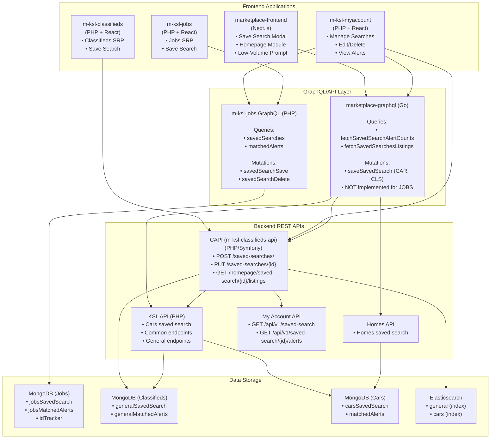

---

## Repository Comparison Matrix

### marketplace-graphql (Go)

| Aspect | Implementation |
| --- | --- |
| **Language** | Go |
| **Framework** | gqlgen (99designs) |
| **Role** | Aggregation/coordination layer |
| **Data Access** | REST APIs only (KSL API, CAPI) |
| **Supported Verticals** | CAR, CLASSIFIED (mutations); All 6 (queries) |
| **Authentication** | JWT via `access_token_cookie` |
| **Concurrency** | Goroutines, channels, worker pools |

**Key Files**:
- `graph/queryresolvers/saved-search.go` - Fetch alert counts
- `graph/queryresolvers/legacy-listing.go` - Fetch saved searches with listings
- `graph/mutationresolvers/legacy-savedsearch.go` - Save/update mutations
- `services/kslapi/legacy_saved_search.go` - KSL API client

### m-ksl-classifieds-api (CAPI - PHP/Symfony)

| Aspect | Implementation |
| --- | --- |
| **Language** | PHP |
| **Framework** | Symfony |
| **Role** | Classifieds REST API |
| **Data Access** | KSL API (writes), MongoDB (reads), Elasticsearch (search) |
| **Supported Verticals** | CLASSIFIED (general) only |
| **Authentication** | Nonce-based (NonceAuthenticatedInterface) + JWT |
| **Validation** | Excessive search check (25,000 listings max for immediate alerts) |

**Key Files**:
- `src/Controller/SavedSearchController.php` - REST endpoints
- `src/Controller/HomepageController.php` - Homepage saved search listings
- `src/Helper/SavedSearchHelper.php` - Business logic
- `src/Db/Mongo/GeneralSavedSearchCollection.php` - MongoDB reader
- `src/Library/KSL/KslApiClient.php` - KSL API client
- `src/Library/MyAccount/MyAccountApiClient.php` - My Account API client

### m-ksl-jobs (PHP)

| Aspect | Implementation |
| --- | --- |
| **Language** | PHP |
| **Framework** | webonyx/graphql-php |
| **Role** | Full backend with data ownership |
| **Data Access** | Direct MongoDB |
| **Supported Verticals** | JOB only |
| **Authentication** | Session-based (`memberCache`) |
| **Events** | GCP Pub/Sub |

**Key Files**:
- `site-api/namespaces/APIGraphQL/FieldObject/SavedSearchesFieldObject.php` - Query
- `site-api/namespaces/APIGraphQL/FieldObject/SavedSearchSaveFieldObject.php` - Mutation
- `site-api/namespaces/APIGraphQL/FieldObject/SavedSearchDeleteFieldObject.php` - Delete
- `site-api/namespaces/APIGraphQL/FieldObject/MatchedAlertsFieldObject.php` - Alerts
- `site-api/namespaces/APIGraphQL/Type/SavedSearchType.php` - Type definition

### m-ksl-myaccount (PHP + React)

| Aspect | Implementation |
| --- | --- |
| **Language** | PHP (controllers) + React (frontend) |
| **Framework** | Zend Framework 1 |
| **Role** | User management UI |
| **Data Access** | Proxies to backend APIs |
| **Supported Verticals** | ALL (Car, Classified, Job, Home) |
| **Authentication** | Session-based |

**Key Files**:
- `application/controllers/SavedSearchesController.php` - Router
- `application/controllers/SavedSearchesCarController.php` - Cars management
- `application/controllers/SavedSearchesJobController.php` - Jobs management
- `application/controllers/SavedSearchesClassifiedController.php` - Classifieds management
- `library/JobsGraphQLProxy.php` - Jobs GraphQL proxy
- `public/aux/assets/src/SavedSearches/` - React components

---

## CAPI Deep Dive

### Overview

CAPI (`m-ksl-classifieds-api`) is the Classifieds REST API built with Symfony. It serves as an intermediary layer for Classifieds saved search operations, providing REST endpoints that:

1. **Create/Update**: Proxy to KSL API for persistence
2. **Read**: Query MongoDB directly for saved search data
3. **Search**: Use Elasticsearch for listing retrieval
4. **Validate**: Enforce business rules (e.g., excessive search check)

### CAPI Architecture

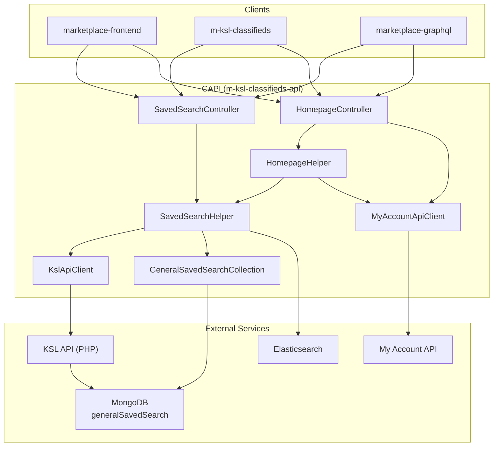

### REST Endpoints

| Endpoint | Method | Controller | Description |
| --- | --- | --- | --- |
| `/saved-searches/` | POST | `SavedSearchController::createSavedSearch` | Create new saved search |
| `/saved-searches/{id}` | PUT | `SavedSearchController::updateSavedSearch` | Update existing saved search |
| `/homepage/saved-search/{id}/listings` | GET | `HomepageController::getSavedSearchListings` | Get listings for homepage carousel |
| `/homepage/get-meta-data` | GET | `HomepageController::getMetaData` | Get homepage data including saved searches |

### Data Flow: Create Saved Search

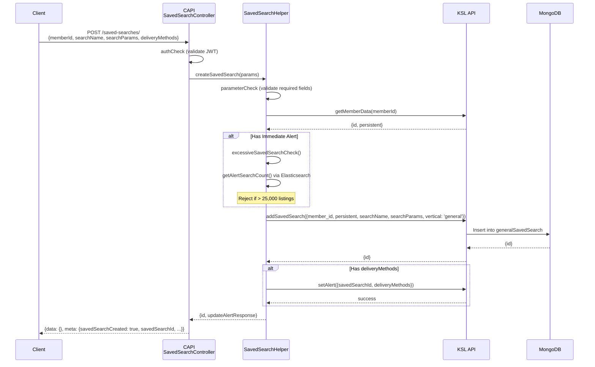

### Key Business Logic

### Excessive Search Check

CAPI enforces a limit of **25,000 listings** for immediate alerts to prevent system overload:

```php
// SavedSearchHelper.phppublic const MAX_LISTING_FOR_IMMEDIATE_ALERT = 25000;public function excessiveSavedSearchCheck(array $searchParams, array $deliveryMethods): bool{
    // Check if email OR push has 'immediately' frequency    if (
        ($deliveryMethods['email']['active'] && $deliveryMethods['email']['frequency'] === 'immediately')
        || ($deliveryMethods['push']['active'] && $deliveryMethods['push']['frequency'] === 'immediately')
    ) {
        $alertSearchCount = $this->getAlertSearchCount($searchParams);        if ($alertSearchCount >= self::MAX_LISTING_FOR_IMMEDIATE_ALERT) {
            return true; // Too broad        }
    }
    return false;}
```

### KSL API Integration

CAPI delegates persistence to KSL API using three endpoints:

| KSL API Endpoint | Purpose |
| --- | --- |
| `classifieds/general/savedSearchesGeneral/addSavedSearch` | Create saved search |
| `classifieds/general/savedSearchesGeneral/updateSavedSearch` | Update saved search |
| `classifieds/general/savedSearchesGeneral/setAlert` | Configure alert delivery |

### MongoDB Direct Read

For performance, CAPI reads saved search data directly from MongoDB rather than through KSL API:

```php
// GeneralSavedSearchCollection.phppublic function getSavedSearch(int $savedSearchId, int $memberId = null): ?array{
    $queryParams = ['id' => $savedSearchId];    if (!empty($memberId)) {
        $queryParams['memberId'] = $memberId;    }
    return $this->generalSavedSearch->findOne($queryParams);}
```

### Homepage Integration

CAPI provides saved search data for the homepage carousel feature:

1. **`getMetaData`**: Fetches user’s saved searches from My Account API
2. **`getSavedSearchListings`**: Returns listings matching a saved search criteria

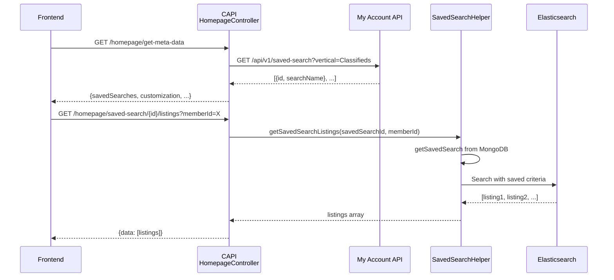

---

## Data Flow Analysis

### Creating a Saved Search

### Flow 1: Cars/Classifieds (via marketplace-graphql)

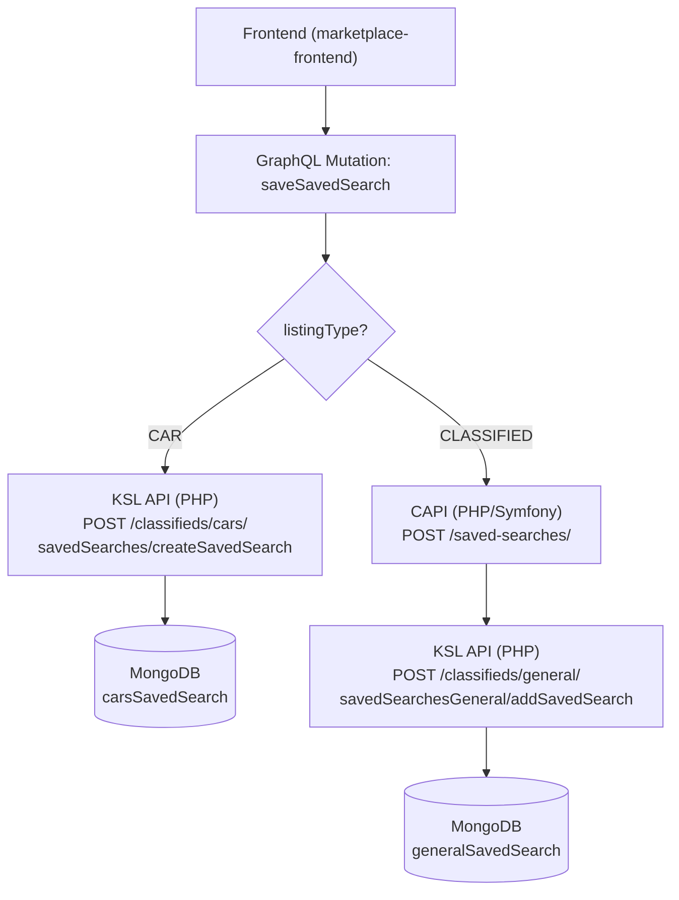

### Flow 1a: Classifieds (via CAPI directly)

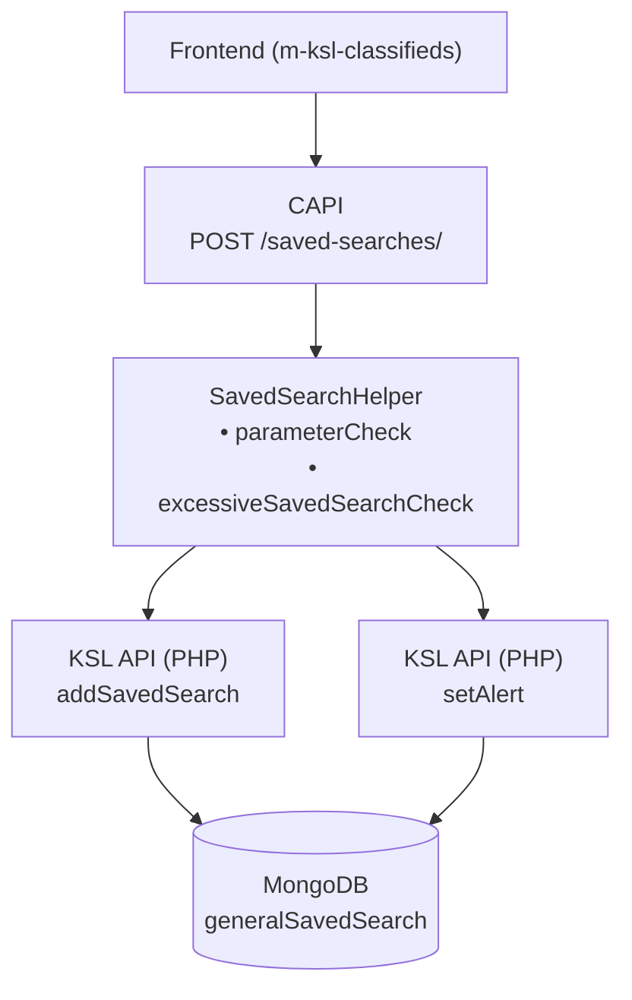

### Flow 2: Jobs (via m-ksl-jobs GraphQL)

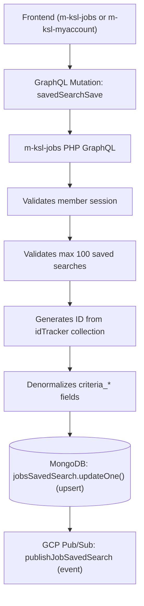

### Fetching Saved Searches

### Flow 1: Alert Counts (marketplace-graphql)

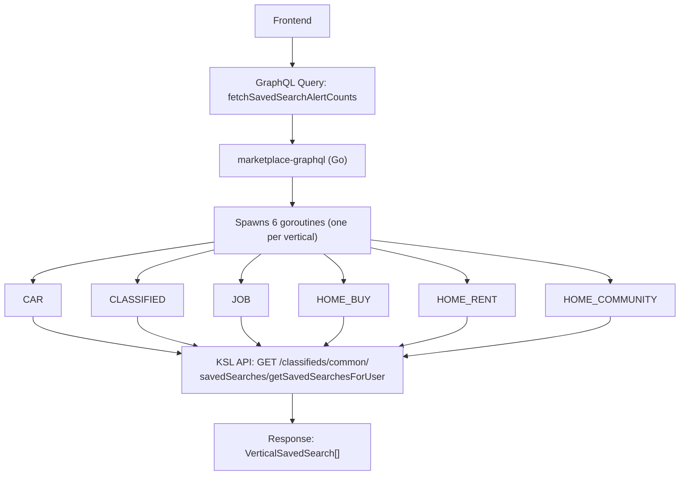

### Flow 2: Jobs with Matched Alerts (m-ksl-jobs)

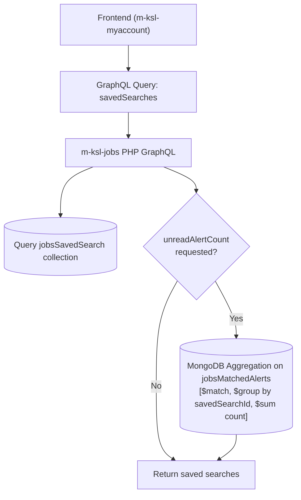

### My Account Management Flow

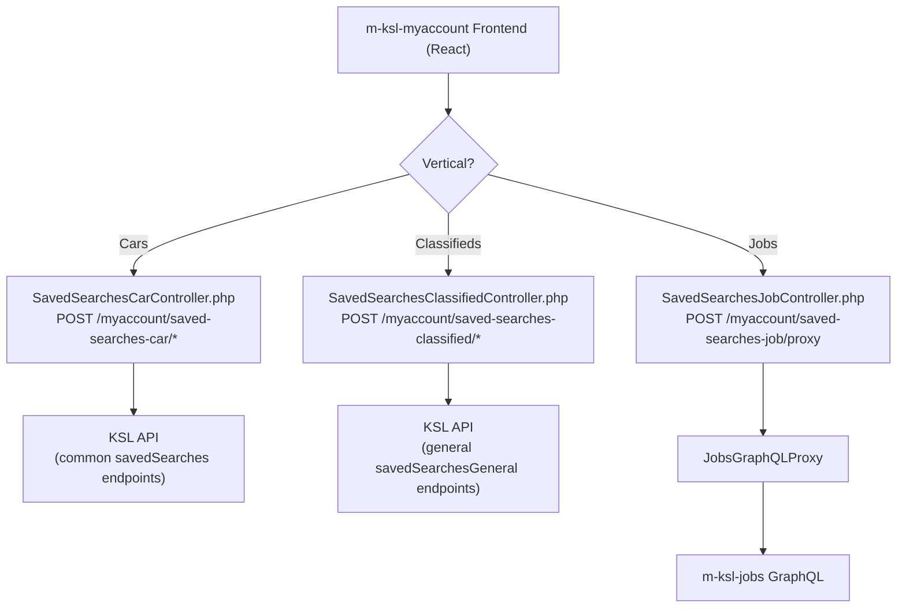

### Classifieds Frontend Flow (m-ksl-classifieds)

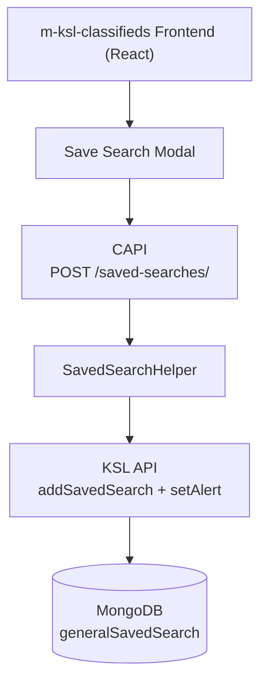

---

## API Endpoints Mapping

### KSL API (Common - Used by Cars)

| Endpoint | Method | Purpose |
| --- | --- | --- |
| `/classifieds/common/savedSearches/getSavedSearchesForUser` | GET | Fetch user’s saved searches |
| `/classifieds/common/savedSearches/getAlertsForSavedSearch` | GET | Fetch alerts for a search |
| `/classifieds/common/savedSearches/addSavedSearch` | POST | Create saved search |
| `/classifieds/common/savedSearches/updateSavedSearch` | POST | Update saved search |
| `/classifieds/common/savedSearches/removeSavedSearch` | POST | Delete saved search |
| `/classifieds/common/savedSearches/setAlert` | POST | Enable/configure alert |
| `/classifieds/common/savedSearches/setAllAlertsViewed` | POST | Mark alerts as viewed |
| `/classifieds/common/savedSearches/removeAlert` | POST | Remove single alert |
| `/classifieds/common/savedSearches/batchUpdateViewedAlerts` | POST | Batch mark viewed |

### KSL API (Cars-specific)

| Endpoint | Method | Purpose |
| --- | --- | --- |
| `/classifieds/cars/savedSearches/createSavedSearch` | POST | Create car saved search |
| `/classifieds/cars/savedSearches/updateSavedSearch` | POST | Update car saved search |

### CAPI (Classifieds - m-ksl-classifieds-api)

| Endpoint | Method | Purpose | Backend |
| --- | --- | --- | --- |
| `/saved-searches/` | POST | Create saved search | KSL API |
| `/saved-searches/{id}` | PUT | Update saved search | KSL API |
| `/homepage/get-meta-data` | GET | Get homepage data incl. saved searches | My Account API |
| `/homepage/saved-search/{id}/listings` | GET | Get listings for saved search carousel | MongoDB + Elasticsearch |

**Internal KSL API Calls (made by CAPI)**:

| KSL API Endpoint | Method | Purpose |
| --- | --- | --- |
| `classifieds/general/savedSearchesGeneral/addSavedSearch` | POST | Create saved search |
| `classifieds/general/savedSearchesGeneral/updateSavedSearch` | POST | Update saved search |
| `classifieds/general/savedSearchesGeneral/setAlert` | POST | Configure alert delivery |

**Internal My Account API Calls (made by CAPI)**:

| My Account API Endpoint | Method | Purpose |
| --- | --- | --- |
| `/api/v1/saved-search` | GET | Fetch user’s saved searches |
| `/api/v1/saved-search/{id}/alerts` | GET | Fetch alerts for a saved search |

### m-ksl-jobs GraphQL

| Operation | Type | Purpose |
| --- | --- | --- |
| `savedSearches` | Query | Fetch user’s saved searches with alert counts |
| `matchedAlerts` | Query | Fetch alerts for a saved search |
| `savedSearchSave` | Mutation | Create or update saved search |
| `savedSearchDelete` | Mutation | Delete saved search |

---

## Feature Comparison

### Core Features

| Feature | marketplace-graphql | CAPI | m-ksl-jobs | m-ksl-myaccount |
| --- | --- | --- | --- | --- |
| Create Saved Search | ✅ (CAR, CLASSIFIED) | ✅ | ✅ | ✅ (proxy) |
| Update Saved Search | ✅ (CAR, CLASSIFIED) | ✅ | ✅ | ✅ (proxy) |
| Delete Saved Search | ❌ | ❌ | ✅ | ✅ (proxy) |
| Fetch Saved Searches | ✅ | ✅ (via My Account API) | ✅ | ✅ (proxy) |
| Fetch with Listings | ✅ | ✅ (homepage carousel) | ✅ | ❌ |
| Alert Counts | ✅ | ✅ (via My Account API) | ✅ (unread count) | ✅ (display) |
| Mark As Viewed | ❌ | ❌ | ✅ | ✅ (proxy) |

### Alert Configuration

| Feature | marketplace-graphql | CAPI | m-ksl-jobs | m-ksl-myaccount |
| --- | --- | --- | --- | --- |
| Email Alerts | ✅ | ✅ | ✅ | ✅ |
| Push Alerts | Schema only | ✅ | Schema only | Schema only |
| Frequency: Immediately | ✅ | ✅ | ✅ | ✅ |
| Frequency: Daily | ✅ | ✅ | ✅ | ✅ |
| Frequency: Weekly | ✅ | ✅ | ✅ | ✅ |
| Max Search Limit | ❌ | ❌ | ✅ (100) | ❌ |
| Immediate Alert Limit | ❌ | ✅ (25,000 listings) | ❌ | ✅ (1000 listings) |

### Advanced Features

| Feature | marketplace-graphql | CAPI | m-ksl-jobs | m-ksl-myaccount |
| --- | --- | --- | --- | --- |
| Pub/Sub Events | ❌ | ❌ | ✅ | ❌ |
| Translated Params | ❌ | ❌ | ✅ | ❌ |
| Denormalized Criteria | ❌ | ❌ | ✅ | ❌ |
| Category/Subcategory | N/A | ✅ | ✅ | ✅ (fetches) |
| Concurrent Fetching | ✅ (goroutines) | ❌ | ❌ | ❌ |
| Worker Pool | ✅ (10 workers) | ❌ | ❌ | ❌ |
| Elasticsearch Search | ✅ (via services) | ✅ (direct) | ❌ | ❌ |
| MongoDB Direct Read | ❌ | ✅ | ✅ | ❌ |

---

## Technology Stack Comparison

| Aspect | marketplace-graphql | CAPI | m-ksl-jobs | m-ksl-myaccount |
| --- | --- | --- | --- | --- |
| **Backend Language** | Go | PHP | PHP | PHP |
| **Framework** | gqlgen | Symfony | webonyx/graphql-php | Zend Framework 1 |
| **Frontend** | N/A (API only) | N/A (API only) | React + jQuery | React + jQuery |
| **API Type** | GraphQL | REST | GraphQL | REST (proxy) |
| **Database** | None (REST only) | MongoDB (read), KSL API (write) | MongoDB | None (API proxy) |
| **Search** | Elasticsearch (via services) | Elasticsearch (direct) | ❌ | ❌ |
| **Authentication** | JWT | Nonce + JWT | Session | Session |
| **State Management** | N/A | N/A | N/A | Flux pattern |
| **Tracing** | DataDog | ❌ | ❌ | ❌ |
| **Package Manager** | Go modules | Composer | Composer | Composer + npm |

---

## My Account Integration

### Vertical Routing

The `SavedSearchesController` routes users to vertical-specific controllers:

```php
$availableVerticalArray = ['classified', 'car', 'home', 'job'];
// Routes to:
// - /myaccount/saved-searches-classified
// - /myaccount/saved-searches-car
// - /myaccount/saved-searches-job
// - /myaccount/saved-searches-home
```

### Controller Responsibilities

| Controller | Backend API | Features |
| --- | --- | --- |
| `SavedSearchesCarController` | KSL API (common) | CRUD, alerts, options fetch |
| `SavedSearchesClassifiedController` | KSL API (general) | CRUD, alerts, immediate alert limit check |
| `SavedSearchesJobController` | m-ksl-jobs GraphQL | CRUD (via GraphQL proxy) |

### Jobs GraphQL Proxy

My Account proxies Jobs saved search operations through a PHP GraphQL proxy:

```php
class JobsGraphQLProxy {
    public static function executeQuery($config, $shouldJsonDecodeContents = true) {
        // Builds request with member session headers        // POSTs to /classifieds/jobs/graphql/index        // Returns GraphQL response    }
}
```

### React Components Structure

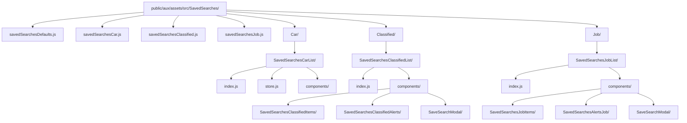

---

## Migration Considerations

### Current Pain Points

1. **Fragmented Architecture**: Each vertical has separate backend implementations
2. **PHP Deprecation**: Jobs backend uses deprecated PHP
3. **No Unified API**: marketplace-graphql cannot create Jobs saved searches
4. **Duplicate Code**: Similar logic repeated across verticals (CAPI, KSL API, Jobs)
5. **Inconsistent Features**: Jobs has Pub/Sub, others don’t
6. **CAPI as Middleman**: For Classifieds, CAPI acts as unnecessary intermediary that just proxies to KSL API
7. **Mixed Data Access Patterns**: CAPI reads from MongoDB directly but writes via KSL API, creating potential consistency issues

---

## Appendix: Code References

### marketplace-graphql Key Types

```go
// Query response types
type SavedSearchAlertCountResponse struct {    
	VerticalSavedSearches []*VerticalSavedSearch
}
type VerticalSavedSearch struct {    
	Vertical      ListingType
  SavedSearches []*SavedSearch
}
type SavedSearch struct {
  ID               int    
  SearchName       *string    
  SearchParams     *string  // JSON string    
  AlertCount       *int    
  AlertViewedCount *int
}

// Mutation input types
type SavedSearchDeliveryMethods struct {    
	Email *SavedSearchDeliveryProperties
  Push  *SavedSearchDeliveryProperties
}
type SavedSearchDeliveryProperties struct {    
	Active    *bool    
	Frequency *SavedSearchFrequencyType  // immediately, daily, weekly
}
```

### m-ksl-jobs Key Types

```php
// SavedSearch document structure
[
    'id' => int,
    'memberId' => int,    
    'searchName' => string,    
    'searchParams' => string,  // JSON    
    'alert' => bool,    
    'deliveryMethods' => [
        'email' => ['active' => bool, 'frequency' => string],
        'push' => ['active' => bool, 'frequency' => string]
    ],    
    'criteria_category' => array,  // Denormalized    
    'criteria_city' => string,    
    'criteria_*' => mixed,    
    'createTime' => UTCDateTime,    
    'modifyTime' => UTCDateTime
]

// MatchedAlert document structure
[
    '_id' => ObjectId,    
    'savedSearchId' => int,    
    'memberId' => int,    
    'searchName' => string,    
    'listingId' => int,    
    'listingCreateTime' => UTCDateTime,    
    'alertCreateTime' => UTCDateTime,    
    'viewed' => bool
]
```

### CAPI Key Types (PHP)

```php
// Create/Update Saved Search Request Body
[
    'memberId' => int,       // Required: Owner of saved search    
    'searchName' => string,  // Required: Title of saved search    
    'searchParams' => [      // Required: Search criteria        
		    'keyword' => string,        
		    'category' => string|array,        
		    'subCategory' => string|array,        
		    'priceFrom' => string,        
		    'priceTo' => string,        
		    'city' => string,        
		    'zip' => string,        // ... other search params    
		 ],    
		 'deliveryMethods' => [   // Optional: Alert configuration        
				 'email' => [
            'active' => bool,            
            'frequency' => 'immediately'|'daily'|'weekly'        
         ],        
         'push' => [
            'active' => bool,            
            'frequency' => 'immediately'|'daily'|'weekly'        
         ]
    ]
]
// Create Response
[
    'data' => [],    
    'meta' => [
        'savedSearchCreated' => true,        
        'savedSearchId' => int,        
        'dateCreated' => int,           // Unix timestamp        
        'updatedAlertStatus' => bool,   // If deliveryMethods provided        
        'updatedAlertMessage' => string // If deliveryMethods provided    
    ]
]
// MongoDB generalSavedSearch document structure (read by CAPI)
[
    'id' => int,    
    'memberId' => int,    
    'searchName' => string,    
    'searchParams' => string,  // JSON encoded    
    'alert' => bool,    
    'deliveryMethods' => [
        'email' => [
		        'active' => bool, 
		        'frequency' => string
		    ],        
		    'push' => [
				    'active' => bool, 
				    'frequency' => string
				]
    ],  
    'vertical' => 'general',    
    'createTime' => UTCDateTime,    
    'modifyTime' => UTCDateTime
]
```

### m-ksl-myaccount Key Endpoints

```
GET  /myaccount/saved-searches-{vertical}              # Index page
POST /myaccount/saved-searches-{vertical}/get-saved-searches
POST /myaccount/saved-searches-{vertical}/add-saved-search
POST /myaccount/saved-searches-{vertical}/delete-saved-search
POST /myaccount/saved-searches-{vertical}/set-alert
POST /myaccount/saved-searches-{vertical}/get-alerts-for-saved-search
POST /myaccount/saved-searches-{vertical}/delete-alert
POST /myaccount/saved-searches-job/proxy              # Jobs GraphQL proxy
```

## UI

### Jobs


### Classifieds


